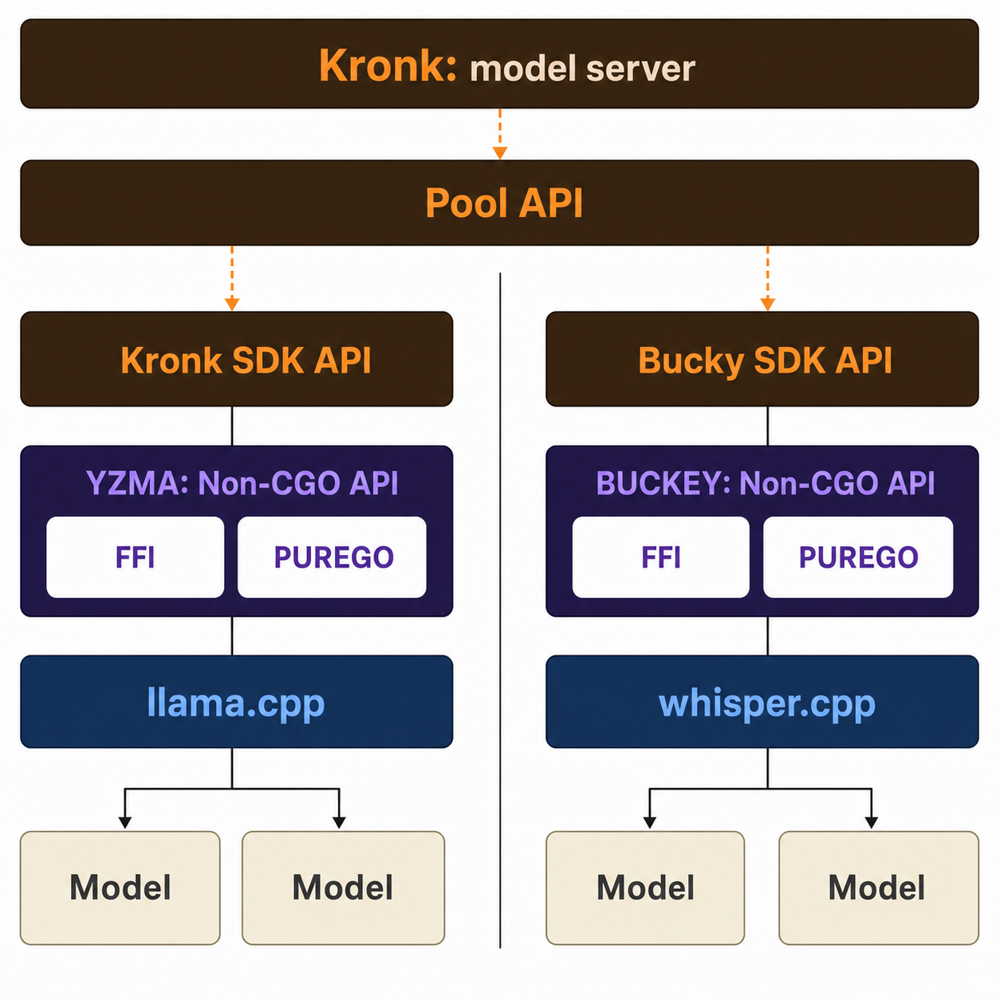

Copyright 2025-2026 Ardan Labs

hello@ardanlabs.com

https://kronkai.com

# Kronk

This project lets you use Go for hardware accelerated local inference with llama.cpp and whisper.cpp directly integrated into your Go applications via the [yzma](https://github.com/hybridgroup/yzma) and [bucky](https://github.com/ardanlabs/bucky) modules. Kronk provides a high-level API that feels similar to using an OpenAI compatible API.

This project also provides a model server for chat completions, responses, messages, embeddings, reranking, and audio transcription. The server is compatible with OpenWebUI, OpenCode, and the Claude Code project.

To see all the documentation, clone the project and run the Kronk Model Server:

```shell
$ make kronk-server

$ make website
```

You can also install Kronk, run the Kronk Model Server, and open the browser to localhost:11435

On macOS or Linux with Homebrew:

```shell
$ brew tap ardanlabs/kronk
$ brew trust ardanlabs/kronk
$ brew install kronk

$ kronk server start
```

Or with Go:

```shell
$ go install github.com/ardanlabs/kronk/cmd/kronk@latest

$ kronk server start
```

Read the [Manual](./manual) to learn more about running the Kronk Model Server.

## Project Status

[](https://pkg.go.dev/github.com/ardanlabs/kronk)
[](https://github.com/ardanlabs/kronk)
[](https://github.com/ggml-org/llama.cpp/releases)

[](https://github.com/ardanlabs/kronk/actions/workflows/linux.yml)

Sometimes there are breaking changes to the family of ggml libraries that require an update to yzma, bucky, malina and/or Kronk. Always choose to use the downloader for each system to make sure you have a compatible version of the libraries. A working version of each library is bound to each release.

Here are some of the known compatible versions:

| llama.cpp | yzma    | kronk  |
| --------- | ------- | ------ |
| b10212+   | v1.22.0 | 1.30.0 |
| b10182+   | v1.21.0 | 1.29.8 |
| b10105+   | v1.20.0 | 1.29.1 |

| whisper.cpp | bucky  | kronk  |
| ----------- | ------ | ------ |
| v1.9.2      | v1.0.8 | 1.30.0 |
| v1.9.1      | v1.0.6 | 1.29.8 |

| stable-diffusion.cpp | malina | kronk   | Notes          |
| -------------------- | ------ | ------- | -------------- |
| master-813-bfbef5b   | v1.0.1 | v1.30.7 | (experimental) |

## Owner Information

```
Name:     Bill Kennedy
Company:  Ardan Labs
Title:    Managing Partner
Email:    bill@ardanlabs.com
BlueSky:  https://bsky.app/profile/goinggo.net
LinkedIn: www.linkedin.com/in/william-kennedy-5b318778/
Twitter:  https://x.com/goinggodotnet
```

## Install Kronk

The recommended way to install Kronk on macOS or Linux is with Homebrew:

```shell
$ brew tap ardanlabs/kronk
$ brew trust ardanlabs/kronk
$ brew install kronk

$ kronk --help
```

To upgrade later:

```shell
$ brew upgrade kronk
```

You can also install via Go on any supported platform:

```shell
$ go install github.com/ardanlabs/kronk/cmd/kronk@latest

$ kronk --help
```

To run Kronk headless with Docker on a remote machine (first run, user
security, auto-restart on reboot, preinstalling models, updating, and
uninstalling), see [Chapter 2.4: Docker / OCI Container](.manual/chapter-02-installation.md#24-docker--oci-container) in the manual.

## Development

From a clone of the project, the test suite runs with:

```shell
$ make test
```

There is also an adversarial probe harness (`zarf/scripts/kronk-stress.sh`) that
exercises a running Kronk server's HTTP API: constrained decoding, the MTP/speculative
decode path, the Anthropic and Responses translations, logprobs, and parameter
validation.

```shell
$ make test-stress                          # deep tier, needs a real model, tens of minutes
$ make test-stress ARGS="--tier=smoke"      # contract probes only, minutes
$ make test-stress ARGS="-l"                # list the probe groups
```

Results land in `zarf/tmp/kronk-stress/findings.txt`. See [Chapter 19.4.2: Server Stress Probes](.manual/chapter-19-developer-guide.md#1942-server-stress-probes) in the manual for tiers, environment variables, and output layout.

## Issues/Features

Here is the existing [Issues/Features](https://github.com/ardanlabs/kronk/issues) for the project and the things being worked on or things that would be nice to have.

If you are interested in helping in any way, please send an email to [Bill Kennedy](mailto:bill@ardanlabs.com).

## Architecture

The architecture of Kronk is designed to be simple and scalable.

Watch this [video](https://www.youtube.com/live/gjSrYkYc-yo) to learn more about the project and the architecture.

### SDK

The Kronk SDK allows you to write applications that can directly interact with local open source GGUF models (supported by llama.cpp) that provide inference for text and media (vision and audio). The Bucky SDK provides the same surface for speech-to-text via whisper.cpp — see the [Bucky chapter](.manual/chapter-18-bucky.md).

Generation uses Kronk's generation batch engine. Supported embedding and
reranking architectures use a separate sequence-batch engine that combines
complete inputs from concurrent requests on one model context; unverified
architectures use a context-pool fallback. See
[Chapter 4](.manual/chapter-04-batch-processing.md) for the runtime and
`nseq-max` behavior.

<picture>
  <source media="(prefers-color-scheme: dark)" srcset="./images/project/sdk-dark.png">
  <source media="(prefers-color-scheme: light)" srcset="./images/project/sdk-light.png">
  
</picture>

Check out the [examples](#examples) section below.

## Models

Kronk uses models in the GGUF format supported by llama.cpp. You can find many models in GGUF format on Hugging Face (over 147k at last count):

models?library=gguf&sort=trending

## Support

Kronk currently has support for over 94% of llama.cpp functionality thanks to yzma. See the yzma [ROADMAP.md](https://github.com/hybridgroup/yzma/blob/main/ROADMAP.md) for the complete list.

You can use multimodal models (image/audio) and text language models with full hardware acceleration on Linux, on macOS, and on Windows.

| OS      | CPU          | GPU                             |
| ------- | ------------ | ------------------------------- |
| Linux   | amd64, arm64 | CUDA, Vulkan, HIP, ROCm, SYCL   |
| macOS   | arm64        | Metal                           |
| Windows | amd64        | CUDA, Vulkan, HIP, SYCL, OpenCL |

Whenever there is a new release of llama.cpp, the tests for yzma are run automatically. Kronk runs tests once a day and will check for updates to llama.cpp. This helps us stay up to date with the latest code and models.

## API Examples

There are examples in the examples direction:

_The first time you run these programs the system will download and install the model and libraries._

[AGENT](examples/agent/main.go) - This example shows you how to write a small coding agent.

```shell
make example-agent
```

[AUDIO](examples/audio/main.go) - This example shows you how to execute a simple prompt against an audio model.

```shell
make example-audio
```

[BUCKY](examples/bucky/main.go) - This example shows you how to transcribe an audio file with the bucky SDK (whisper.cpp under the hood). See the manual chapter [Bucky (Audio Transcription)](.manual/chapter-18-bucky.md) for the full subsystem reference.

```shell
make example-bucky
```

[BUCKY-STREAM](examples/bucky-stream/main.go) - This example shows you how to do live microphone transcription with the bucky streaming SDK: partials are revised in place and finals commit as you speak. Say "STOP" to end. See [Streaming Transcription](.manual/chapter-18-bucky.md#189-streaming-transcription-sdk) in the manual.

```shell
make example-bucky-stream
```

[BUCKY-DIAR](examples/bucky-diar/main.go) - This example shows you how to do channel-separated speaker diarization with the bucky SDK: each speaker is recorded on a dedicated channel, and `TranscribeChannelsFile` transcribes every channel on its own and merges the results into one time-sorted transcript tagged by speaker. See [Channel-Separated Diarization](.manual/chapter-18-bucky.md#188-sdk-quick-start) in the manual.

```shell
make example-bucky-diar
```

[CHAT](examples/chat/main.go) - This example shows you how to chat with the chat-completion api.

```shell
make example-chat
```

[CONCURRENCY](examples/concurrency/main.go) - This example shows you how to leverage concurrency using vision models.

```shell
make example-concurrency
```

[EMBEDDING](examples/embedding/main.go) - This example shows you a basic program using Kronk to perform an embedding operation.

```shell
make example-embedding
```

[GRAMMAR](examples/grammar/main.go) - This example shows how to use GBNF grammars to constrain model output.

```shell
make example-grammar
```

> [!WARNING]
> The Malina SDK is experimental. Its public API is subject to change.

[MALINA](examples/malina/main.go) - This example shows how to generate a PNG with the Malina SDK and a local stable-diffusion.cpp model. Set `MALINA_LIB` to the native library directory and `MALINA_MODEL` to an all-in-one checkpoint file.

```shell
MALINA_LIB=/path/to/libs MALINA_MODEL=/path/to/model.safetensors make example-malina
```

[MALINA-FLUX2](examples/malina-flux2/main.go) - This example generates a PNG from a multi-file FLUX.2 pipeline using separate diffusion, VAE, and LLM components.

```shell
MALINA_LIB=/path/to/libs MALINA_DIFFUSION_MODEL=/path/to/flux.gguf \
MALINA_VAE_MODEL=/path/to/ae.safetensors MALINA_LLM_MODEL=/path/to/qwen.gguf \
make example-malina-flux2
```

[MALINA-IMG2IMG](examples/malina-img2img/main.go) - This example transforms an existing PNG or JPEG with a prompt and configurable strength.

```shell
MALINA_LIB=/path/to/libs MALINA_MODEL=/path/to/model.safetensors make example-malina-img2img
```

[MALINA-SD-ENCODE](examples/malina-sd-encode/main.go) - This example encodes a directory of PNG and JPEG frames into a Motion-JPEG AVI without loading a model.

```shell
make example-malina-sd-encode
```

[MALINA-SYSTEM](examples/malina-system/main.go) - This example initializes Malina and displays stable-diffusion.cpp system diagnostics without loading a model.

```shell
MALINA_LIB=/path/to/libs make example-malina-system
```

[POOL](examples/pool/main.go) - This example shows you how to use the pool package to manage multipl models in memory at the same time.

```shell
make example-pool
```

[QUESTION](examples/question/main.go) - This example shows you how to ask a simple question with the chat-completion api.

```shell
make example-question
```

[RAG](examples/rag/main.go) - This example shows you a complete RAG application.

```shell
make example-rag
```

[RERANK](examples/rerank/main.go) - This example shows you how to use a rerank model.

```shell
make example-rerank
```

[RESPONSE](examples/response/main.go) - This example shows you how to chat with the response api.

```shell
make example-question
```

[SESSION-STORE](examples/session-store/main.go) - This example shows how to implement and inject a custom IMC session store. Its temporary disk backend demonstrates the extension contract but is not durable storage.

```shell
make example-session-store
```

[VISION](examples/vision/main.go) - This example shows you how to execute a simple prompt against a vision model.

```shell
make example-vision
```

[YZMA](examples/yzma/main.go) - This example shows you how to use the yzma api at it's basic level.

```shell
make example-yzma
```

You can find more examples in the ArdanLabs AI training repo at [Example13](https://github.com/ardanlabs/ai-training/tree/main/cmd/examples/example13).

## Sample API Program - Question Example

```go
// This example shows you a basic program of using Kronk to ask a model a question.
//
// The first time you run this program the system will download and install
// the model and libraries.
//
// Run the example like this from the root of the project:
// $ make example-question

package main

import (
	"context"
	"fmt"
	"os"
	"time"

	"github.com/ardanlabs/kronk/sdk/kronk"
	"github.com/ardanlabs/kronk/sdk/kronk/model"
	"github.com/ardanlabs/kronk/sdk/tools/libs"
	"github.com/ardanlabs/kronk/sdk/tools/models"
)

const modelSource = "unsloth/Qwen3-0.6B-Q8_0"

func main() {
	if err := run(); err != nil {
		fmt.Printf("\nERROR: %s\n", err)
		os.Exit(1)
	}
}

func run() error {
	mp, err := installSystem()
	if err != nil {
		return fmt.Errorf("unable to install system: %w", err)
	}

	krn, err := newKronk(mp)
	if err != nil {
		return fmt.Errorf("unable to init kronk: %w", err)
	}

	defer func() {
		fmt.Println("\nUnloading Kronk")
		if err := krn.Unload(context.Background()); err != nil {
			fmt.Printf("failed to unload model: %v", err)
		}
	}()

	if err := question(krn); err != nil {
		fmt.Println(err)
	}

	return nil
}

func installSystem() (models.Path, error) {
	ctx, cancel := context.WithTimeout(context.Background(), 15*time.Minute)
	defer cancel()

	libs, err := libs.New(
		libs.WithDetect(ctx, kronk.FmtLogger),
	)
	if err != nil {
		return models.Path{}, err
	}

	if _, err := libs.Download(ctx, kronk.FmtLogger); err != nil {
		return models.Path{}, fmt.Errorf("unable to install llama.cpp: %w", err)
	}

	if err := kronk.Init(kronk.WithLibPath(libs.LibsPath())); err != nil {
		return models.Path{}, fmt.Errorf("unable to init kronk: %w", err)
	}

	// -------------------------------------------------------------------------

	mdls, err := models.New()
	if err != nil {
		return models.Path{}, fmt.Errorf("unable to init models: %w", err)
	}

	mp, err := mdls.Download(ctx, kronk.FmtLogger, modelSource)
	if err != nil {
		return models.Path{}, fmt.Errorf("unable to install model: %w", err)
	}

	return mp, nil
}

func newKronk(mp models.Path) (*kronk.Kronk, error) {
	fmt.Println("loading model...")

	krn, err := kronk.New(
		model.WithModelFiles(mp.ModelFiles),
		model.WithAutoTune(true),
	)
	if err != nil {
		return nil, fmt.Errorf("unable to create inference model: %w", err)
	}

	fmt.Print("- system info:\n\t")
	for k, v := range krn.SystemInfo() {
		fmt.Printf("%s:%v, ", k, v)
	}
	fmt.Println()

	fmt.Println("- contextWindow  :", krn.ModelConfig().ContextWindow())
	fmt.Printf("- k/v            : %s/%s\n", krn.ModelConfig().CacheTypeK, krn.ModelConfig().CacheTypeV)
	fmt.Println("- flashAttention :", krn.ModelConfig().FlashAttention())
	fmt.Println("- nBatch         :", krn.ModelConfig().NBatch())
	fmt.Println("- nuBatch        :", krn.ModelConfig().NUBatch())
	fmt.Println("- modelType      :", krn.ModelInfo().Type)
	fmt.Println("- template       :", krn.ModelInfo().Template.FileName)
	fmt.Println("- grammar        :", krn.ModelConfig().DefaultParams.Grammar != "")
	fmt.Println("- nSeqMax        :", krn.ModelConfig().NSeqMax())
	fmt.Println("- vramTotal      :", krn.ModelInfo().VRAMTotal/(1024*1024), "MiB")
	fmt.Println("- slotMemory     :", krn.ModelInfo().SlotMemory/(1024*1024), "MiB")
	fmt.Println("- modelSize      :", krn.ModelInfo().Size/(1000*1000), "MB")
	fmt.Println("- imc            :", krn.ModelConfig().IncrementalCache())
	if n := krn.ModelConfig().PtrNGpuLayers; n != nil {
		fmt.Println("- nGPULayers     :", *n)
	} else {
		fmt.Println("- nGPULayers     : all")
	}
	if sm := krn.ModelConfig().PtrSplitMode; sm != nil {
		fmt.Println("- splitMode      :", sm)
	} else {
		fmt.Println("- splitMode      : auto")
	}

	return krn, nil
}

func question(krn *kronk.Kronk) error {
	ctx, cancel := context.WithTimeout(context.Background(), 120*time.Second)
	defer cancel()

	question := "Hello model"

	fmt.Println()
	fmt.Println("QUESTION:", question)
	fmt.Println()

	d := model.D{
		"messages": model.DocumentArray(
			model.TextMessage(model.RoleUser, question),
		),
		"temperature": 0.7,
		"top_p":       0.9,
		"top_k":       40,
		"max_tokens":  2048,
	}

	ch, err := krn.ChatStreaming(ctx, d)
	if err != nil {
		return fmt.Errorf("chat streaming: %w", err)
	}

	// -------------------------------------------------------------------------

	var reasoning bool

	for resp := range ch {
		switch resp.Choices[0].FinishReason() {
		case model.FinishReasonError:
			return fmt.Errorf("error from model: %s", resp.Choices[0].Delta.Content)

		case model.FinishReasonStop:
			return nil

		default:
			if resp.Choices[0].Delta.Reasoning != "" {
				reasoning = true
				fmt.Printf("\u001b[91m%s\u001b[0m", resp.Choices[0].Delta.Reasoning)
				continue
			}

			if reasoning {
				reasoning = false
				fmt.Println()
				continue
			}

			fmt.Printf("%s", resp.Choices[0].Delta.Content)
		}
	}

	return nil
}
```

This example can produce the following output:

```shell
$ make example-question
cd examples && go run ./question/main.go
KRONK: 2026-07-31T16:48:48.063008-07:00: select-host-runtime: preferred[metal] selected[metal] reason[preferred host runtime retained]
KRONK: 2026-07-31T16:48:48.096632-07:00: download-libraries: check libraries version information: arch[arm64] os[darwin] processor[metal]
KRONK: 2026-07-31T16:48:48.096765-07:00: download-libraries: check llama.cpp installation: arch[arm64] os[darwin] processor[metal] latest[b10216] current[b10216]
KRONK: 2026-07-31T16:48:48.096775-07:00: download-libraries: already installed: latest[b10216] current[b10216]
KRONK: 2026-07-31T16:48:48.105792-07:00: download-model: model file:  Qwen3-0.6B-Q8_0.gguf -> already downloaded:
loading model...
- system info:
	LLAMAFILE:on, ACCELERATE:on, REPACK:on, MTL:EMBED_LIBRARY, CPU:NEON, ARM_FMA:on, DOTPROD:on,
- contextWindow  : 32768
- k/v            : f16/f16
- flashAttention : auto
- nBatch         : 2048
- nuBatch        : 2048
- modelType      : dense
- template       : tokenizer.chat_template
- grammar        : false
- nSeqMax        : 1
- vramTotal      : 4545 MiB
- slotMemory     : 3584 MiB
- modelSize      : 633 MB
- imc            : true
- nGPULayers     : all
- splitMode      : layer

QUESTION: Hello model

Okay, the user said "Hello model," so I need to respond politely. I should greet them, maybe mention that I'm here to help, and offer assistance. Keep it friendly and open-ended. Let me make sure there's no confusion and that the response is clear and helpful.

! How can I assist you today? 😊
Unloading Kronk
```

## Travel Schedule

Come find me in any of these cities or events this year. I will be giving workshops and talks about Kronk

| Dates           | Event                      | Location              | Comments       |
| --------------- | -------------------------- | --------------------- | -------------- |
| Jan 29th - 2nd  | AI Plumbers Fringe, FOSDEM | Brussels, Belgium     | Talk           |
| Mar 4th - 5th   | Ardan Connect              | São Paulo, Brazil     | Workshop       |
| Apr 20th - 25th | Gophercamp 2026            | Brno, Czech Republic  | Workshop, Talk |
| Apr 27th - 29th | AI Dev 26                  | San Francisco, USA    | Attendee       |
| May 17th - 23rd | Gophercon Signapore        | Singapore             | Workshop, Talk |
| Jun 8th - 12th  | Genetec Corporate Training | Montreal, Canada      | Workshop       |
| Jun 14th - 19th | GopherCon EU               | Berlin, Germany       | Workshop, Talk |
| JULY            | Summer Vacation            | Huntsville, AL        | Rest           |
| Aug 3rd - 6th   | GopherCon USA              | Seattle, Washington   | Workshop, Talk |
| Aug 11th - 13th | GopherCon UK               | London, England       | Workshop, Talk |
| Sep 1st - 4th   | GopherCon LATAM            | Florianópolis, Brazil | Workshop, Talk |
| Sep 23rd        | Meetup NYC                 | NYC, NY               | Talk           |
| Oct 6th - 9th   | Crusoe Corporate Training  | San Francisco, USA    | Workshop       |
| Oct 12th - 18th | GopherCon Africa           | Kenya, East Africa    | Workshop, Talk |
| Oct 29th - 4th  | GoLab (GopherCon Italy)    | Bologna, Italy        | Workshop, Talk |
